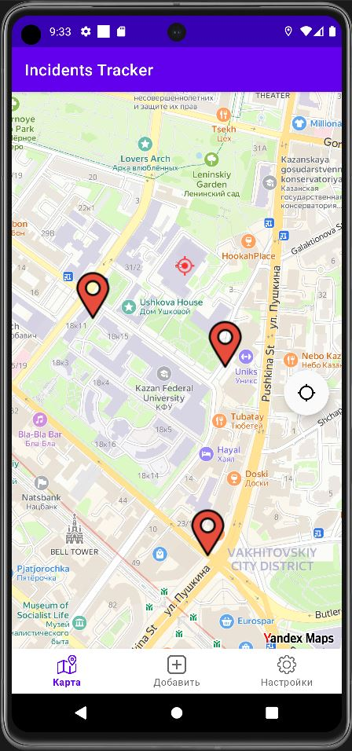
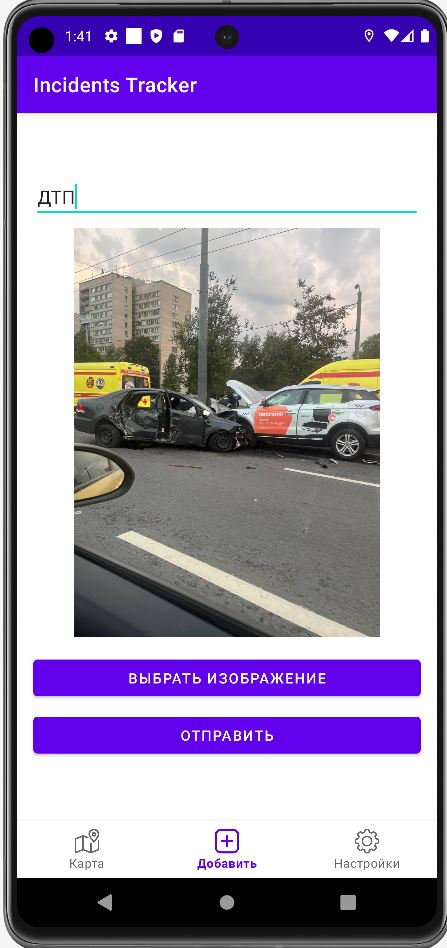
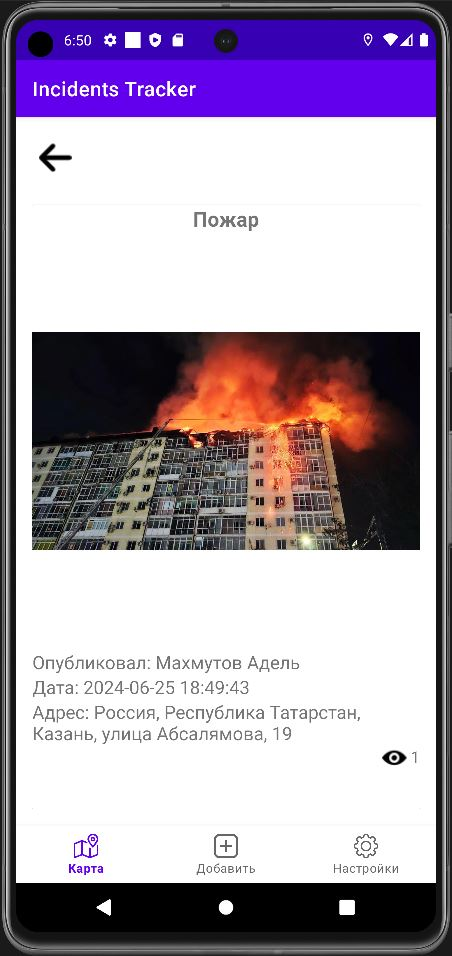

# Дипломная работа

## Мобильное приложение для фиксации происшествий и информирования о них (Клиент)
> Автор: Махмутов Адель Наилевич  
telegram: @Vodypep  
Ссылка на серверную часть: https://github.com/Adelbas/incidents-tracker-backend

### Описание решения
Для написания программы использовался следующий стек технологий:
* Kotlin
* Hilt
* [YandexMapkit](https://yandex.ru/dev/mapkit/doc/ru/)
* [StompProtocolAndroid](https://github.com/NaikSoftware/StompProtocolAndroid)

### Пользовательский интерфейс
| Страница с картой | Добавление происшествия                                      | Страница с происшествием                              |
| -- | ---------------------------------------- | ---------------------------------------- |
|    |  |  |